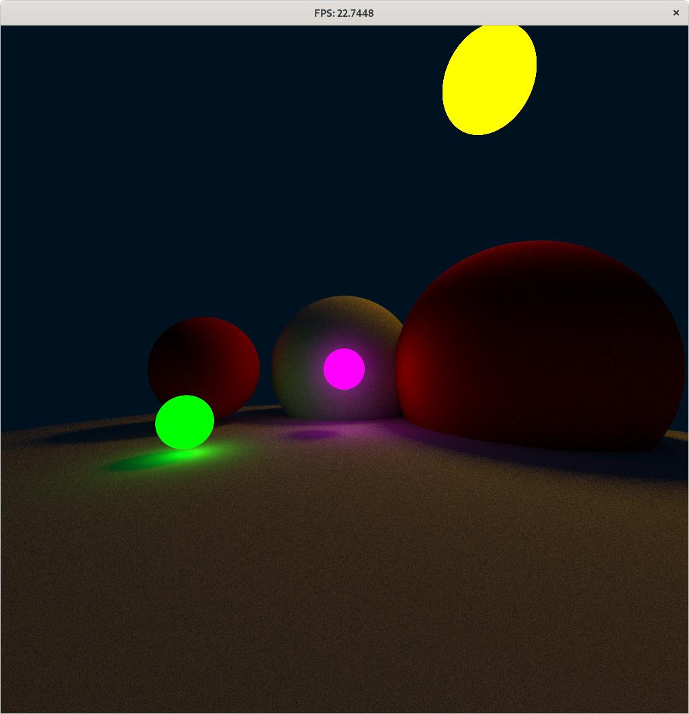

# pasta-braider

Ray-tracing framework written in D as a learning project (both for D and for writing my own proper raytracing stuff from scratch)

## Features

 * Somewhat optimised, heavily templated vector maths (makes use of SIMD intrinsics and results in reasonnable assembly)
 * Absolutely no GC happens during traversal (guaranteed by tagging all the RT functions `@nogc`)
 * Reasonnably fast (half the point of this exercise is finding out if D can be competitive in high performance stuff)
 * Can intersect spheres and triangles, no AS support yet
 * Debug renderer
 * Direct lighting renderer
 * Basic correct (if very naïve) path tracing renderer
    * only diffuse and mirror materials for now
    * BSDF model for materials
    * Both hemisphere sampling & next event estimation are available

## Compiling

Please use `ldc` since `DMD` is a joke perf-wise, and also please tell it to actually optimise ! The default "release" config is still quite conservative in the grand scheme of things.

`DFLAGS="-release -O3 -ffast-math -boundscheck=off -flto=thin -mcpu=znver1" dub run --compiler=ldc2` should do the trick. Make sure the -mcpu flag matches your config for best perf !

## Performance notes

 * You may notice disabling the usage of SIMD intrinsics in `vector.d` *significantly* improves performance on Ryzen, by about a factor of 33%. That's equivalent to the overhead of doing 33% more ops by using a vec4 packed in 128 bits instead of an array of 3 float for `Vec3f` ), having spent a few evenings looking at the assembly, I believe this is due to the Ryzen front-end being smart enough to vectorize stuff by itself and doing so is more effective than SSE/AVX instructions. On older architectures (ie haswell), this isn't the case and explicit SIMD is essential, so make sure to tweak that accordingly !
 * LTO sometimes actually hurts performance, try without too !
 * MT scaling is not perfect (it's also really crappy and naive for now)

## Prettyness

